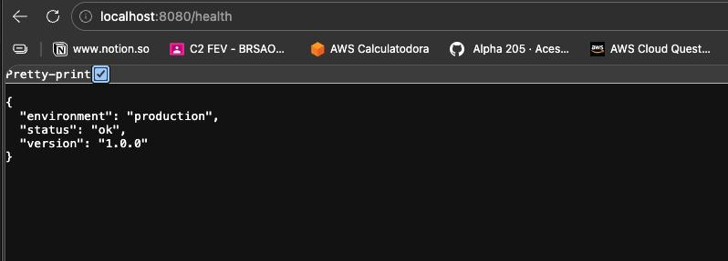
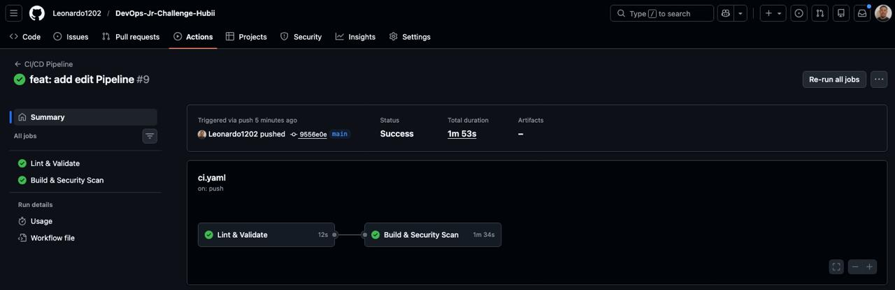

# DevOps-Jr-Challenge-Hubii

# 🚀 Hubii DevOps Jr Challenge

Solução para o desafio técnico de DevOps Jr da Hubii.  
Projeto organizado com foco em **clareza, boas práticas e fundamentos sólidos**.

---

## 📁 Estrutura do Projeto

```
hubii-devops-challenge/
├── app/
│   ├── main.py               # Aplicação Python/Flask
│   └── requirements.txt      # Dependências
├── k8s/
│   ├── namespace-and-secret.yaml
│   ├── deployment.yaml
│   ├── service.yaml
│   └── ingress.yaml
├── terraform/
│   ├── main.tf
│   ├── variables.tf
│   ├── outputs.tf
│   └── terraform.tfvars.example
├── .github/
│   └── workflows/
│       └── ci.yml            # Pipeline GitHub Actions
├── docs/
│   ├── pipeline-success.png
│   └── app-health.png
├── Dockerfile
├── SECURITY.md
└── README.md
```

---

## Parte 1 – Aplicação

Aplicação simples em **Python + Flask** que expõe um endpoint `/health`.

### Como executar localmente

**Pré-requisitos:** Python 3.12+

```bash
cd app
pip install -r requirements.txt
APP_ENV=development python main.py
```

Acesse: [http://localhost:8080/health](http://localhost:8080/health)

**Resposta esperada:**
```json
{
  "status": "ok",
  "version": "1.0.0",
  "environment": "development"
}
```

### ✅ Aplicação rodando



### Decisões técnicas
- **Flask** foi escolhido por ser leve e direto ao ponto para uma API simples.
- **Gunicorn** é usado como servidor WSGI em produção (mais estável que o servidor embutido do Flask).
- O valor de `APP_ENV` é lido via variável de ambiente, com fallback para `"development"`.

---

## Parte 2 – Docker

### Como executar com Docker

```bash
# Build
docker build -t hubii-app:local .

# Run
docker run -p 8080:8080 -e APP_ENV=production hubii-app:local

# Teste
curl http://localhost:8080/health
```

### Decisões tomadas na construção da imagem

| Decisão | Motivo |
|---|---|
| **Multi-stage build** | Separa o ambiente de build do runtime, resultando em imagem menor e sem ferramentas de compilação expostas |
| **`python:3.12-slim`** | Imagem oficial reduzida — menos pacotes = menos CVEs potenciais |
| **Usuário não-root (`appuser`)** | Evita que o processo dentro do container tenha privilégios de root no host |
| **`PYTHONDONTWRITEBYTECODE=1`** | Não gera arquivos `.pyc` desnecessários na imagem |
| **Gunicorn como entrypoint** | Servidor WSGI adequado para produção — o servidor de desenvolvimento do Flask não é recomendado |

### Possíveis melhorias de segurança/otimização

- Migrar para imagem **distroless** (`gcr.io/distroless/python3`) — elimina shell e utilitários, reduzindo ainda mais a superfície de ataque.
- Fixar hash de todas as dependências com `pip-compile` para garantir builds reprodutíveis e seguros.
- Integrar `pip-audit` no pipeline para verificar CVEs nos pacotes Python.
- Assinar a imagem com **Cosign** (Sigstore) para garantia de integridade na supply chain.

---

## Parte 3 – Kubernetes

### Pré-requisitos

- `kubectl` configurado com acesso a um cluster (ex: [minikube](https://minikube.sigs.k8s.io/), [kind](https://kind.sigs.k8s.io/), ou EKS/GKE/AKS)
- Ingress Controller instalado (ex: `nginx-ingress`)

### Como aplicar os manifestos

```bash
# 1. Criar namespace e secret
kubectl create secret generic hubii-app-secret \
  --from-literal=app-env=production \
  -n hubii

# 2. Aplicar os demais recursos
kubectl apply -f k8s/deployment.yaml
kubectl apply -f k8s/service.yaml
kubectl apply -f k8s/ingress.yaml

# 3. Verificar
kubectl get pods -n hubii
kubectl get svc -n hubii
```

### Destaques dos manifestos

- **`APP_ENV` via Secret:** a variável de ambiente é injetada a partir de um Kubernetes Secret, não hardcoded.
- **Requests/Limits definidos:** garante que a aplicação não consuma recursos além do previsto e o scheduler possa alocar corretamente.
- **`readinessProbe`:** evita que o pod receba tráfego antes de estar pronto.
- **`livenessProbe`:** reinicia automaticamente o pod caso a aplicação trave ou pare de responder.
- **`SecurityContext`:** `allowPrivilegeEscalation: false`, `readOnlyRootFilesystem: true` e `capabilities.drop: [ALL]` para hardening do container.
- **Ingress com TLS:** configurado para redirecionar HTTP → HTTPS.

---

## Parte 4 – Pipeline CI/CD

O pipeline está em `.github/workflows/ci.yml` e é executado em todo push/PR para `main`.

### ✅ Pipeline em execução — ambos os jobs com sucesso



### Etapas

```
push/PR → [Lint & Validate] → [Build & Security Scan]
```

| Etapa | Ferramenta | O que faz |
|---|---|---|
| **Lint Python** | `flake8` | Valida estilo e erros no código |
| **Validate K8s** | `kubeval` | Verifica sintaxe dos manifestos Kubernetes |
| **Build imagem** | Docker | Constrói a imagem |
| **Scan de segurança** | **Trivy** | Escaneia CVEs CRITICAL/HIGH e reporta no Security tab |
| **Push** | GHCR | Publica a imagem no GitHub Container Registry (apenas em `main`) |

> O pipeline **falha imediatamente** em qualquer etapa com erro, garantindo que código com problemas não avance.

### Melhorias possíveis para produção

- Adicionar etapa de **testes automatizados** (pytest).
- Implementar **deploy automático** para staging após build bem-sucedido.
- Adicionar gate de aprovação manual para deploy em produção.
- Usar **OIDC** para autenticar com a cloud sem necessidade de chaves estáticas.
- Bloquear pipeline em CVEs CRITICAL após migrar para imagem distroless.

---

## Parte 5 – Terraform

### Como usar

```bash
cd terraform

# Copiar e preencher variáveis
cp terraform.tfvars.example terraform.tfvars

# Inicializar
terraform init

# Planejar (dry-run)
terraform plan

# Aplicar
terraform apply
```

### O que é provisionado

Um **S3 Bucket** na AWS com:
- Bloqueio total de acesso público
- Versionamento habilitado
- Criptografia server-side (AES-256)
- Tags de projeto/ambiente

### Outputs

| Output | Descrição |
|---|---|
| `bucket_name` | Nome do bucket criado |
| `bucket_arn` | ARN do bucket |
| `bucket_region` | Região onde foi criado |

### Melhorias possíveis

- Adicionar **backend remoto** (S3 + DynamoDB) para gerenciar o `terraform.tfstate` de forma compartilhada e com locking.
- Usar **módulos** para reusabilidade (ex: módulo `s3-bucket` reutilizável em múltiplos ambientes).
- Integrar `terraform plan` no pipeline de CI como validação de infra.

---

## Parte 6 – Segurança

Consulte o arquivo [`SECURITY.md`](./SECURITY.md) para a documentação completa de segurança, cobrindo:

- Gerenciamento de segredos (Vault, External Secrets Operator)
- Prevenção de exposição de credenciais
- Hardening da imagem Docker
- Boas práticas de acesso em ambientes cloud

---

## ✅ Checklist do Desafio

- [x] Aplicação Python com endpoint `/health`
- [x] Variável de ambiente `APP_ENV`
- [x] Dockerfile com usuário não-root e multi-stage build
- [x] Kubernetes: Deployment, Service, Ingress
- [x] Deployment com requests/limits, readiness/liveness probes
- [x] Segredos não expostos nos manifestos
- [x] Pipeline GitHub Actions com lint, build, Trivy scan
- [x] Terraform com variáveis, resource e outputs
- [x] Documentação de segurança (`SECURITY.md`)
- [x] README completo com evidências de execução

---

## 🛠️ Tecnologias utilizadas

`Python` · `Flask` · `Gunicorn` · `Docker` · `Kubernetes` · `GitHub Actions` · `Trivy` · `Terraform` · `AWS S3`